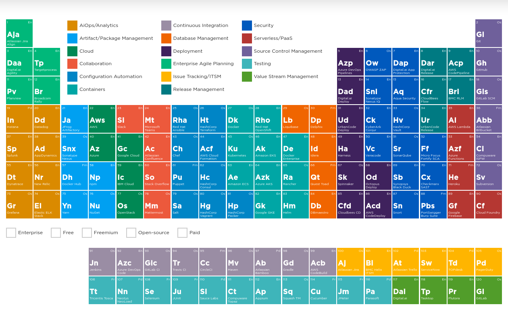
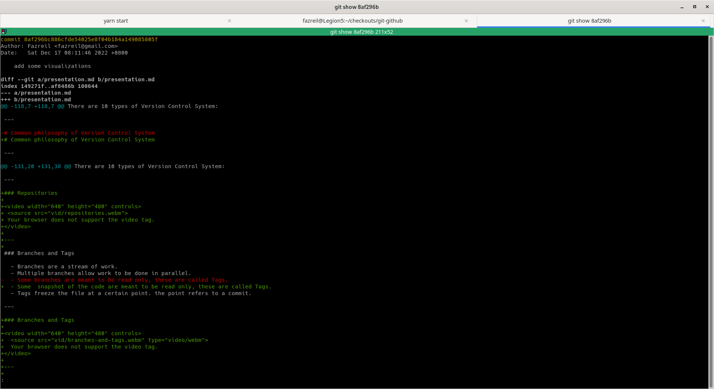
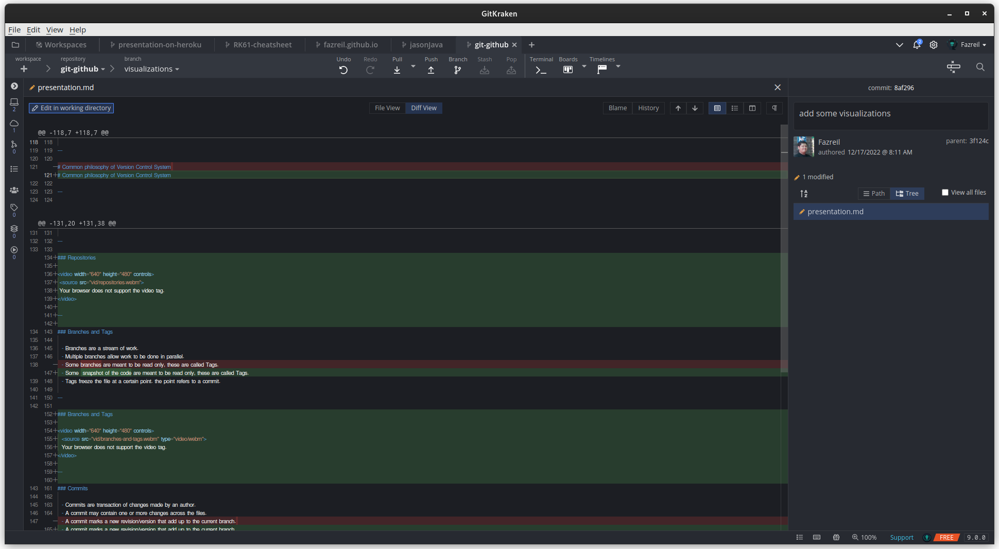
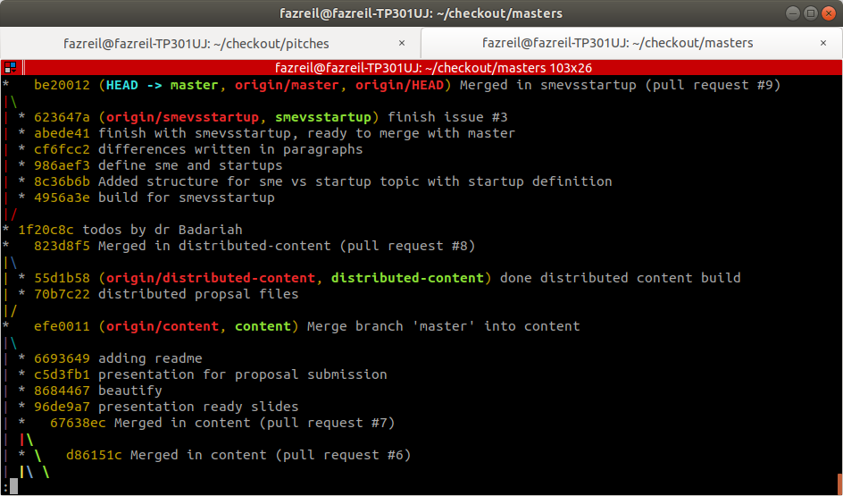
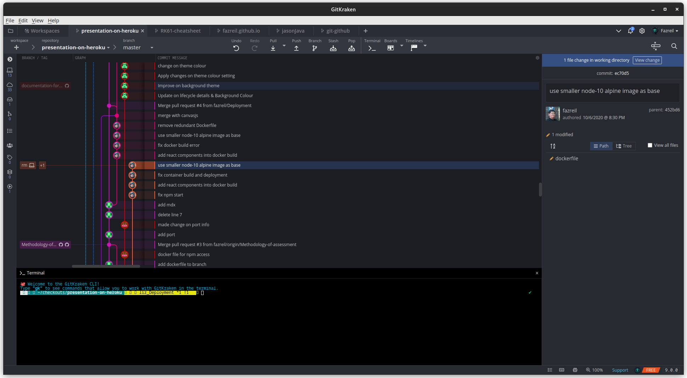
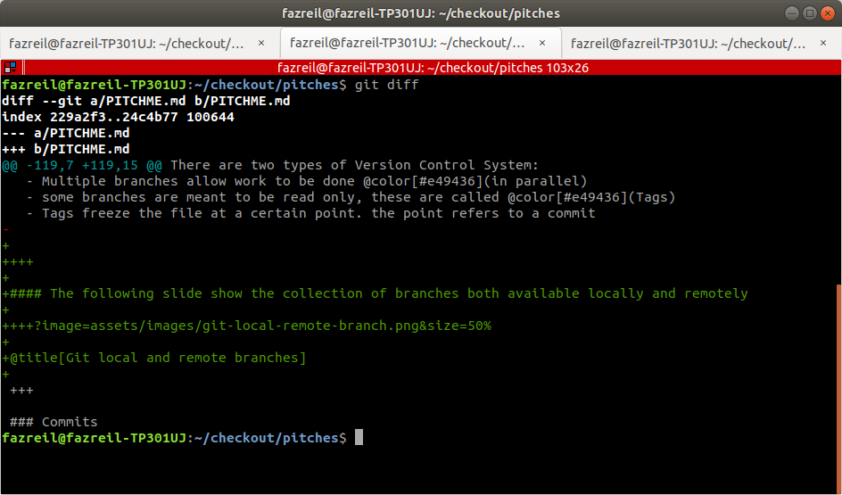

title: Git and Github
author:
  name: Fazreil Amreen
  twitter: fab52
  url: https://www.facebook.com/fazreil/
output: presentation.html
controls: true

---

# Git & Github

---

### Ts. Fazreil Amreen bin Abdul Jalil

<table>
    <td>
        
    </td>
    <td>
        

            <ul>
                <li>Git Consultant</li>
                <li>Virtual Machines configurator (automated using hashicorp vagrant)</li>
                <li>HUDSON/JENKINS Builder initiator and driver.</li>
                <li>Completed Hacktoberfest Challenge 2019, 2020, 2021, 2022</li>
                <li>Go-cloud advocate.</li>
                <li>Worked behind NTLM proxy</li>
            <ul>
        

    </td>
</table>
---

### What is version control system

>A component of software configuration management, version control / revision control / source control, is the management of changes to documents, computer programs, large web sites, and other collections of information.

*Retrieved from: [Wikipedia](https://en.wikipedia.org/wiki/Version_control)*

---

### What is version control system

>Version control systems are a category of software tools that help a software team manage changes to source code over time.

*Retrieved from: [Atlassian](https://www.atlassian.com/git/tutorials/what-is-version-control)*

---

### Where VCS sits in Software Engineering pool of tools?

[DevOps periodic table by digital.ai](https://periodictable.digital.ai/?_ga=2.138960625.355262457.1670018840-299794160.1630333354)

---

### Types of version control system

There are 10 types of Version Control System:
  - Centralized VCS
  - Distributed VCS

---

### Centralized VCS

  - Logs changes in the **central** server.
  - Less **conflicts**.
  - Easy to **administer**.

---

### Distributed VCS

  - Keep the changes in its **local repository**.
  - Enable work to be carried out **offline**.
  - Cultivate the culture of **open source**.

---

### Difference between Centralized and Distributed VCS

<table>
    <td>
      <video width="320" height="240" controls>
       <source src="vid/versus-centralized.webm">
       Your browser does not support the video tag.
      </video>
    </td>
    <td>
      <video width="320" height="240" controls>
       <source src="vid/versus-distributed.webm">
       Your browser does not support the video tag.
      </video>
    </td>
</table>

---

# Popular Version Control System

---

### GIT

  - Distributed VCS.
  - Biggest user base.
  - Has a **lot of commands** to manipulate git.

---

### SVN and CVS

  - Centralized VCS.
  - Pre-Git users are used to Subversion/SVN.
  - Most **straight forward approach** in Version Control System.
  - Uses trunk, branch, tag approach.

---

### Clearcase

  - Centralized VCS.
  - A VCS backed by **IBM**.
  - Visually interesting, uses config spec which produce a comprehensive set of files.

---

### mercurial

  - Distributed VCS.
  - Fast, written in **python** (platform independent).
  - Claim to have behavior similar to SVN. Migrating to mercurial would be easy.

---

# Common philosophy of Version Control System

---

### Commits

  - Commits are transaction of changes made by an author.
  - A commit may contain one or more changes across the files.
  - A commit marks a new revision/version that add up to the current branch.

---

### Anatomy of a commit

<table>
  <td>
    
  </td>
  <td>
    
  </td>
</table>

---

### Branches and Tags

  - Branches are a stream of work.
  - Multiple branches allow work to be done in parallel.
  - Some  snapshot of the code are meant to be read only, these are called Tags.
  - Tags freeze the file at a certain point. the point refers to a commit.

---

### Branches and Tags

<video width="640" height="480" controls>
  <source src="vid/branches-and-tags.webm" type="video/webm">
  Your browser does not support the video tag.
</video>

---

### Repositories

  - Repositories are basically the storage space to place the content.
  - Repositories shall store files relevant to itself.
  - Sometimes repositories sharing do happen, then it gets confusing.
  - A repository is usually invisible to other repositories.

---

### Repositories

<video width="640" height="480" controls>
 <source src="vid/repositories.webm">
 Your browser does not support the video tag.
</video>

---

### Logs

  - List of commits.
  - May show the relation between branches.
  - Useful to show the work done for certain file.

---

### Logs

<table>
    <td>
      
    </td>
    <td>
      
    </td>
</table>

---

### Diff

  - A diff is a comparison between two commits.
  - A diff can also be a comparison between an unstaged and a versioned files.
  - Useful when trying to figure out what happened between commits.

---

### Diff

---

### Merging

  - Merging is an act of combining the content of two branches.
  - Modern tools usually have auto merging feature built in.
  - Manual merge is required when there are conflicts arise during merge.
  - Manual merging is a process of picking relevant changes into the branch.

---

# Git Workflow

---

### Git Workflow

<video width="640" height="480" controls>
  <source src="vid/git-workflow.webm" type="video/webm">
  Your browser does not support the video tag.
</video>

---

# Practical use of VCS

---

### Update your code frequently
  - To avoid conflicts, update code frequently.
  - It will be best to work on the latest code.
  - Conflicts might are not just at the code level, but branch level.

---

### Manage conflicts diligently
  - Keep changes to their respective commits.
  - If there are multiple changes that are irrelevant to each other, it will be hard to manage the commits.

---

### Commit relevant changes with relevant message
  - Best to group a commit to relevant files being modified.
  - while committing a bunch of files is easy, committing the files with common commit makes the log more readable.

---

### VCS is not just for coding
  - VCS can be utilised to record changes of files.
  - Work best with plaintext.
  - Can also work with keeping configuration files of applications.
  - These slides are version controlled with GIT.

---

# Q&A
